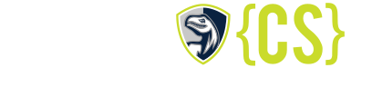

# LASA{CS}

## General Information

All code in this repository was created by Ryan Kellar, Class of 2025, at the Liberal Arts and Science Academy. The code is intended to be used for educational purposes only.

### Courses

Out of the LASA{CS} curriculum, I have taken the following:
- AP Computer Science A (2022-2023)
- Advanced Computer Science (2023-2024)
- Web and Mobile Applications (2023-2024)
- Logic & Computational Problem Solving (2023-2024) [which is not a CS course, but similar enough in nature]
- Independent Study in Computer Science (2024-2025)
- Digital Electronics (2024-2025)

Not all of the code from the above courses are included in this repository; only code that we created in repl.it was downloaded directly by me right before repl.it shut down educational courses.

### Special Note

Note that the curriculum may be different from the time that the code in this repository was created. The purpose of this repository is not to provide people with solutions to assignments, but rather to provide a reference for students who are struggling with the material. I have also included some of my own projects that I have created outside of the curriculum.

## Contact Information

If you have a question about the code (or another inquiry) or need further clarification, feel free to reach out to me at my email: rt.kellar@gmail.com or open an issue on this repository.

## Miscellaneous

If you are a student of LASA{CS} and would like to contribute to this repository, feel free to reach out to me. I would be happy to add you as a collaborator.

If you are a teacher of LASA{CS} and would like any or all of this code removed, please reach out to me and I will remove it as soon as possible.